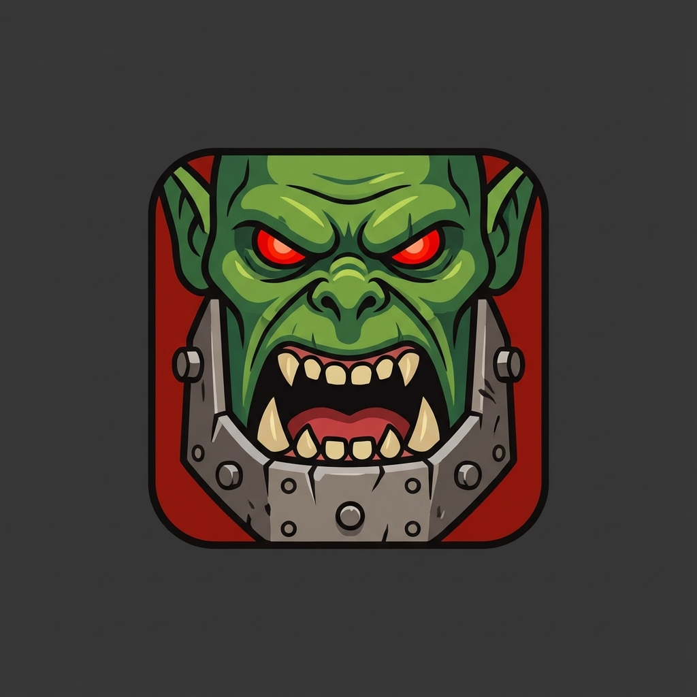

# TrubleShoota 🛠️👹 Note: Image path assumes repo structure


**"DA BOYZ DIAGNOSTICS - IF IT AIN'T BROKE, FIX IT ANYWAY!"**

## Overview

**TrubleShoota** is a high-performance, cross-platform network diagnostic suite wrapped in a "battle-hardened" Warhammer 40k Ork aesthetic. Built with **Tauri**, **Rust**, and **React**, it combines the raw speed of native code with a modern, responsive user interface.

It empowers network engineers, sysadmins, and "Mekboyz" to rapidly troubleshoot connectivity, analyze packet captures, and audit network security without touching a command line.

## 🧰 Mek Shop Tools (Features)

*   **Battle Plans (Profiles):** One-click diagnostic suites for specific scenarios (e.g., "Gamer Mode", "Office Work", "Streamer").
*   **Git Da IP (DNS Lookup):** Fast naming resolution checking for A and AAAA records.
*   **Path Finder (MTR/Traceroute):** Real-time hop-by-hop latency visualization.
*   **Door Kicker (Port Scanner):** High-speed asynchronous TCP port scanner.
*   **Who's There? (LAN Scan):** Discovers devices on your local network (ARP/Ping).
*   **More Dakka (Throughput):** Measures connection speed and bandwidth checking.
*   **Packet Smasher (MTU):** Path MTU Discovery to find fragmentation issues.
*   **Grot Sifter (PCAP Analyzer):**
    *   Drag-and-drop `.pcap` analysis.
    *   Detects deprecated TLS (SSL 3.0/TLS 1.0) usage.
    *   Identifies top talkers, plaintext credentials, and DNS tunneling.
*   **Waaagh! Waves (WiFi Analyzer):** Visualizes signal strength (RSSI), BSSID, and Channel interference.
*   **Choppa Calc (Subnet):** Visual subnet calculator with binary "bit" visualization.
*   **Loot Sorter (Firewall Converter):** Converts IP lists into firewall-compliant formats (Cisco, Ubiquiti, etc.).

## 🎯 Use Cases

*   **Network Auditing:** Quickly identify unauthorized devices on a LAN or open ports on a server.
*   **Security Compliance:** Scan traffic dumps (PCAPs) for insecure legacy protocols like SSL v3.
*   **ISP Troubleshooting:** Verify if your ISP is delivering promised speeds or if specific hops are dropping packets.
*   **Gaming Optimization:** Check NAT types, jitter, and packet loss to ensure a lag-free WAAAGH!
*   **Deployment config:** Calculate subnets and generate firewall config snippets instantly.

## 💾 Installation

### Windows (Pre-built)
1.  Download the latest installer from the [Releases](https://github.com/your-repo/trubleshooter/releases) page.
2.  Run `TrubleShoota_0.1.0_x64-setup.exe`.
3.  Launch the app and start smashin' bugs!

*(Linux and MacOS builds are coming soon... once we figure out how to make them loud enough).*

## ⚙️ Compiling from Source

If you want to tinker with the Mek code yourself, here is how you build it from scratch.

### Prerequisites
*   **Node.js** (v18+)
*   **Rust** (v1.70+)
*   **Build Tools** (C++ Build Tools for Windows)

### Build Steps

1.  **Clone the Repo**
    ```bash
    git clone https://github.com/your-username/trubleshooter.git
    cd trubleshooter
    ```

2.  **Install Frontend Dependencies**
    ```bash
    npm install
    ```

3.  **Run in Development Mode** (Hot Reloading)
    ```bash
    npm run tauri dev
    ```

4.  **Build Production Executable**
    ```bash
    npm run tauri build
    ```
    The installer will be generated at:
    `src-tauri/target/release/bundle/nsis/TrubleShoota_x.x.x_x64-setup.exe`

## 🏗️ Architecture

*   **Frontend:** React, TypeScript, TailwindCSS, Lucide Icons.
*   **Backend:** Rust (Tauri 2.0), Tokio (Async Runtime).
*   **Modules:**
    *   `net_ops.rs`: Core network logic (Ping, Scan, Trace).
    *   `pcap_analysis.rs`: Packet parsing engine.
    *   `wifi.rs`: Signal analysis integration.
    *   `system.rs`: Hardware resource monitoring.

## 🤝 Contributing

Got a better way to smash packets? Pull requests are welcome! Just make sure your code compiles and you don't break the build (or else...).

---
*made with ❤️ and ☕ by the DeepMind Advanced Coding Team*
